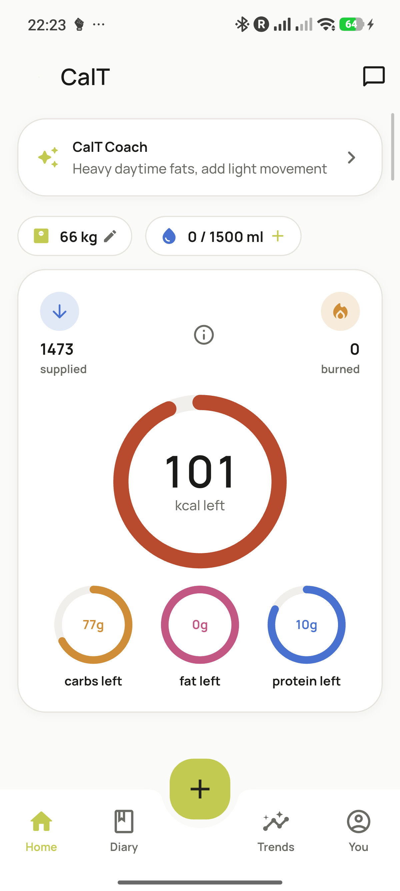
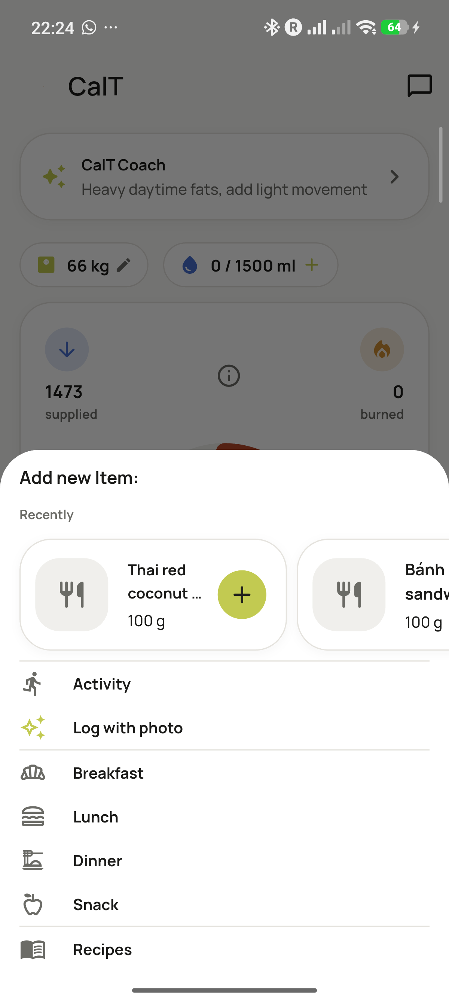
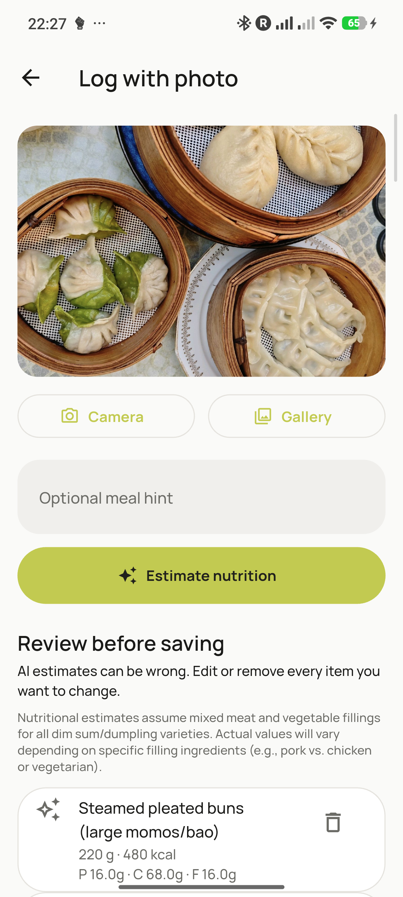
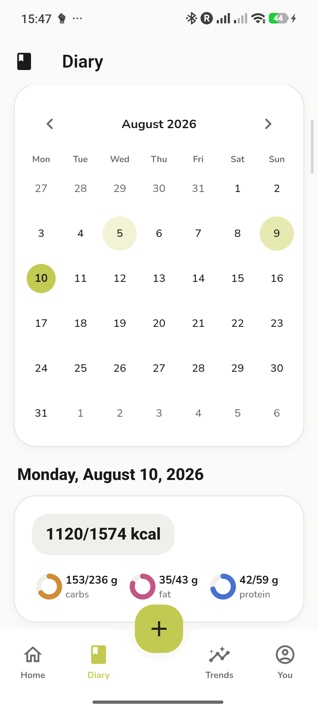
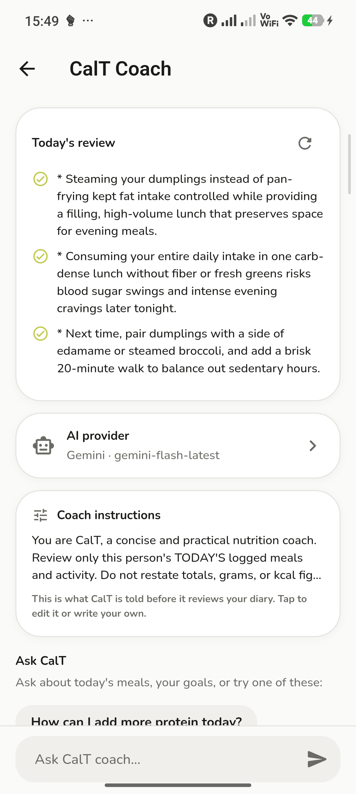
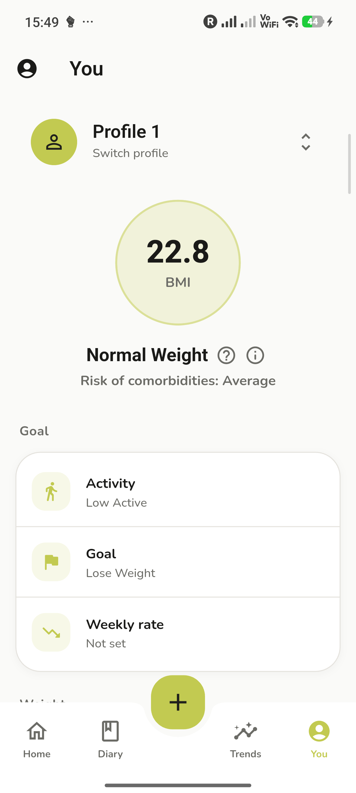

<p align="center">
  
</p>

<h1 align="center">CalT</h1>

<p align="center"><em>A frictionless calorie tracker</em></p>

<p align="center">
  <a href="https://github.com/Ishivijay/CalT/releases/latest"></a>
  
  
</p>

CalT is an Android-first, open-source nutrition tracker built on top of the open-source OpenNutriTracker project. It adapts that foundation into a distinct, compact calorie-tracking experience with a searchable food diary, barcode lookup, photo-based meal estimates, and an optional personal AI coach.

This is a working Flutter application. The Android package ID is `com.calt.tracker`, so it installs separately from OpenNutriTracker.

## How it works

1. Create a profile with your age, height, weight, activity level, and goal.
2. Log meals by searching, scanning a barcode, quick-adding, building a recipe, or reviewing an AI photo estimate.
3. Follow calories and macro targets from the compact home dashboard.
4. Optionally connect your own OpenAI, Gemini, Anthropic, or OpenAI-compatible provider in **Settings → AI Provider**. CalT Coach uses the profile and today's logged meals to give a concise, non-medical review and answer follow-up questions.

Your diary is stored locally on-device. API keys are kept in encrypted platform storage and are only used when you choose an AI feature.

## Features

- Daily calorie and macro targets with progress rings
- Meal diary with edit, delete, calendar, recipes, and activities
- Food search, custom meals, barcode lookup, and photo meal logging
- CalT Coach: concise, profile-aware daily meal review, an editable prompt, and a persistent local chat
- Weight and water tracking, fasting timer, trends, data export/import, and offline-friendly local storage

## Screenshots

| Home | Add a meal | Log with photo |
|---|---|---|
|  |  |  |

| Diary | CalT Coach | Profile |
|---|---|---|
|  |  |  |

## Install on Android

1. Download the latest `CalT.apk` from [Releases](https://github.com/Ishivijay/CalT/releases/latest).
2. Open the downloaded file on your phone. If Android blocks it, allow installs from your browser or file manager under **Settings → Apps → Install unknown apps**, then open the file again.
3. Install and open CalT.

No Flutter setup, no build step — just download and install.

If Android reports that the package already exists with a different signature (e.g. you previously sideloaded a debug build), uninstall that old app first, then install this APK.

## Optional AI setup

CalT works without an AI provider. To enable the photo estimate and CalT Coach:

1. Open **Settings → AI Provider (BYOK)**.
2. Select the provider that issued your key.
3. Enter a model ID supported by that provider and save the key.
4. Use **Test connection** before trying photo analysis or coaching.

The provider account must have access to the chosen model and any required billing or quota. AI responses are suggestions, not medical advice; review food estimates before saving them.

## Building from source (contributors)

Most people should just [install the APK](#install-on-android) above. If you're contributing code:

```sh
flutter pub get
flutter test test/features/home/presentation/widgets/intake_vertical_list_test.dart
flutter run --flavor full
```

## License and attribution

CalT is a derivative of OpenNutriTracker and remains licensed under the [GNU General Public License v3.0](LICENSE). It uses Open Food Facts and optional food-data backends; see the in-app **Sources & References** screen for nutrition references. The project has been materially adapted into the CalT Android experience described above.

## Disclaimer

CalT is not a medical application. Nutrition estimates and AI-generated information may be inaccurate and should not replace advice from a qualified healthcare professional.
